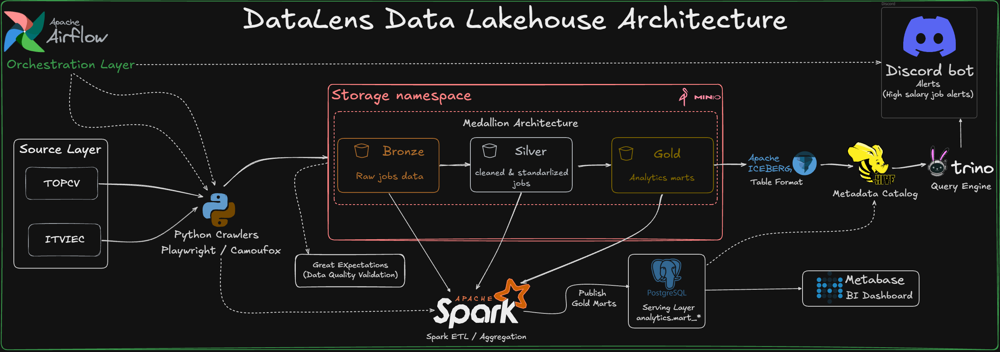
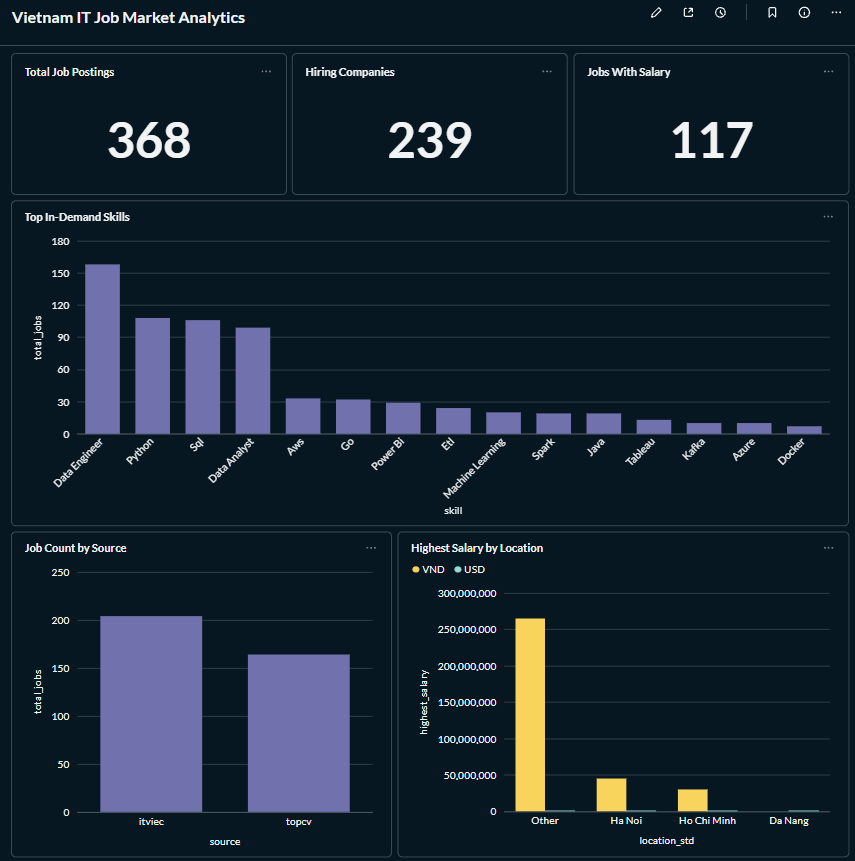
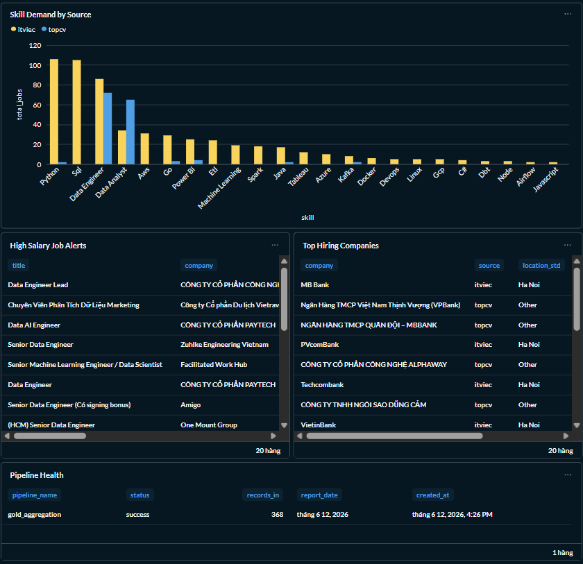

# 🚀 DataLens Data Lakehouse: Vietnam IT Job Market Analytics


---

## 📌 Project Overview

**DataLens** is an end-to-end **Data Engineering portfolio project** that builds a production-like data lakehouse for analyzing the **Vietnam IT labor market**.

The pipeline automatically collects IT job postings from platforms such as **ITviec** and **TopCV**, stores raw data in a data lake, validates data quality, cleans and standardizes job records, creates analytics-ready Gold marts, publishes dashboard-ready tables to PostgreSQL, and visualizes insights in Metabase.

The project demonstrates a complete batch data platform including:

* Web data ingestion
* Batch ETL orchestration
* Data cleaning and normalization
* Medallion architecture
* Apache Iceberg lakehouse tables
* SQL analytics with Trino
* PostgreSQL BI serving layer
* Metabase dashboard
* Discord high-salary job alerts
* Data quality validation
* Unit testing for transformation logic

---

## 🎯 Business Problem

Vietnam's IT job market data is scattered across multiple job platforms. Each platform has different formats for job titles, company names, locations, salary ranges, posted dates, and skill tags. This makes it difficult to analyze hiring demand, salary trends, popular technical skills, and high-salary opportunities in a consistent way.

**DataLens** solves this problem by turning messy job posting data into reliable analytics data products.

The project answers business questions such as:

* How many IT jobs are currently available?
* Which companies are hiring the most?
* Which technical skills are most in demand?
* Which locations have the highest hiring activity?
* How many jobs publish salary information?
* Which jobs are high-salary opportunities?
* Is the data pipeline running successfully and producing fresh data?

---

## 🏗️ Architecture



### Data Flow

```text
ITviec / TopCV
      |
      V
Python Crawlers
      |
      V
MinIO Bronze Layer
      |
      V
Great Expectations Validation
      |
      V
Spark Silver Transformation
      |
      V
Spark Gold Aggregation
      |
      V
Apache Iceberg Gold Tables on MinIO
      |
      V
Trino Query Engine
      |
      V
Discord Alerts
```

For dashboard serving:

```text
Gold Analytics Marts
      |
      V
PostgreSQL Serving Layer
      |
      V
Metabase BI Dashboard
```

---

## 🔁 Pipeline Design

### 1. Ingestion Layer

Python crawlers collect job postings from:

| Source | Description                                        |
| ------ | -------------------------------------------------- |
| ITviec | Vietnam IT job postings                            |
| TopCV  | Vietnam job postings with IT/data-related keywords |

The crawlers extract raw job data such as:

* Job title
* Company
* Location
* Salary
* Tags / skills
* Job URL
* Posted date
* Source name

Raw data is uploaded to MinIO as the Bronze layer.

---

### 2. Bronze Layer

The Bronze layer stores raw job posting data.

Purpose:

* Preserve raw crawled data
* Support replay and debugging
* Keep source-level records before cleaning

Example:

```text
s3a://data-lake/bronze/
```

---

### 3. Silver Layer

The Silver layer contains cleaned and standardized job records.

Main transformations:

* Flatten raw JSON structures
* Standardize job titles
* Normalize locations
* Parse salary ranges
* Detect currency
* Deduplicate job URLs
* Standardize source names
* Prepare clean records for analytics

Expected Silver table:

```text
demo.silver.jobs
```

---

### 4. Gold Layer

The Gold layer contains business-ready analytics marts stored as Apache Iceberg tables.

Expected Gold tables:

```text
demo.gold.mart_job_market_overview
demo.gold.mart_source_performance
demo.gold.mart_salary_by_location
demo.gold.mart_company_hiring_trend
demo.gold.mart_skill_demand
demo.gold.mart_high_salary_alerts
demo.gold.mart_pipeline_health
```

Backward-compatible legacy tables are also maintained for older dashboard or Discord logic:

```text
demo.gold.itviec_jobs
demo.gold.market_summary
demo.gold.source_stats
demo.gold.daily_alerts
```

---

## 🧱 Data Products

| Data Product                | Purpose                                                                                |
| --------------------------- | -------------------------------------------------------------------------------------- |
| `mart_job_market_overview`  | Executive KPIs such as total jobs, companies, sources, locations, and jobs with salary |
| `mart_source_performance`   | Tracks job volume and salary availability by source                                    |
| `mart_salary_by_location`   | Analyzes salary distribution by location, source, and currency                         |
| `mart_company_hiring_trend` | Identifies top hiring companies                                                        |
| `mart_skill_demand`         | Aggregates in-demand skills from job titles and tags                                   |
| `mart_high_salary_alerts`   | Provides high-salary job opportunities                                                 |
| `mart_pipeline_health`      | Tracks pipeline status, input records, run date, and processing timestamp              |

---

## 🗄️ PostgreSQL Serving Layer

Although Apache Iceberg is the main lakehouse table format, Metabase consumes dashboard-ready data from PostgreSQL for simpler and faster BI access.

Gold marts are published to PostgreSQL under the `analytics` schema:

```text
analytics.mart_job_market_overview
analytics.mart_source_performance
analytics.mart_salary_by_location
analytics.mart_company_hiring_trend
analytics.mart_skill_demand
analytics.mart_high_salary_alerts
analytics.mart_pipeline_health
```

This design separates:

| Component      | Role                          |
| -------------- | ----------------------------- |
| Apache Iceberg | Lakehouse source of truth     |
| Trino          | SQL query engine over Iceberg |
| PostgreSQL     | BI serving layer              |
| Metabase       | Dashboard visualization       |

---

## 📊 Dashboard Output

The Metabase dashboard provides a business-facing view of Vietnam IT job market analytics.



### Current Sample Run

Latest successful pipeline output:

```text
Total job postings: 368
Hiring companies: 239
Data sources: 2
Locations: 4
Jobs with salary: 117
PostgreSQL serving tables: 7
```

### Dashboard Metrics

| Metric / Chart         | Insight                                             |
| ---------------------- | --------------------------------------------------- |
| Total Job Postings     | Shows the size of the collected IT job market data  |
| Hiring Companies       | Measures how many companies are actively recruiting |
| Jobs With Salary       | Tracks salary transparency in job postings          |
| Job Count by Source    | Compares data contribution from ITviec and TopCV    |
| Top In-Demand Skills   | Identifies skills most requested by employers       |
| Salary by Location     | Compares salary opportunities across locations      |
| Top Hiring Companies   | Shows companies with the highest hiring activity    |
| High-Salary Job Alerts | Lists jobs that satisfy high-salary thresholds      |
| Pipeline Health        | Monitors whether the Gold pipeline ran successfully |

---

## 🤖 Discord Bot Alerts

The Discord bot sends high-salary job alerts and daily market reports.


High-salary alert rules:

```text
USD salary: min_salary >= 1000
VND salary: min_salary >= 20,000,000
```

The alerting layer uses curated Gold data, making it more reliable than directly alerting from raw crawler output.

---

## ✅ Data Quality

Great Expectations is used as the data quality validation component.

Validation focuses on:

* Required fields such as `url`, `title`, and `source`
* Valid source values such as `itviec` and `topcv`
* Duplicate job URL detection
* Salary field validity
* Salary range consistency
* Non-empty pipeline outputs

Example quality rules:

```text
url must not be null
title must not be null
source must be in [itviec, topcv]
url should be unique
min_salary <= max_salary
Gold marts should not be empty
```

More details:

* [Data Quality Rules](docs/data_quality_rules.md)

---

## 🧪 Testing

This project includes unit tests for core normalization logic used in the Silver layer.

Test coverage includes:

* Salary parsing
* Location normalization
* Job title normalization

Run tests:

```bash
pytest tests
```

Example test result:

```text
................. [100%]
```

This means all 17 normalization tests passed.

---

## 🔁 Backfill and Retry Strategy

The pipeline is orchestrated by Apache Airflow and designed to support retryable batch processing.

Production-like strategies include:

* Airflow task retries
* Source-level crawler isolation
* Idempotent Gold writes using Iceberg `MERGE INTO`
* PostgreSQL serving table refresh
* Pipeline health tracking
* Backfill-ready partitioning by run date

More details:

* [Backfill and Retry Strategy](docs/backfill_retry_strategy.md)

---

## 🛠️ Tech Stack

| Category         | Technology                                       |
| ---------------- | ------------------------------------------------ |
| Language         | Python, SQL                                      |
| Web Ingestion    | Python Crawlers, Playwright / browser automation |
| Processing       | Apache Spark, PySpark                            |
| Orchestration    | Apache Airflow                                   |
| Data Quality     | Great Expectations                               |
| Object Storage   | MinIO                                            |
| Table Format     | Apache Iceberg                                   |
| Metadata Catalog | Hive Metastore                                   |
| Metadata Backend | PostgreSQL                                       |
| Query Engine     | Trino                                            |
| BI Serving Layer | PostgreSQL                                       |
| BI Dashboard     | Metabase                                         |
| Alerting         | Discord Bot                                      |
| Infrastructure   | Docker, Docker Compose                           |
| Testing          | Pytest                                           |

---

## 📂 Project Structure

```text
VNJobs_API_DataLakeHouse/
├── dags/                         # Airflow DAGs
├── jobs/
│   ├── crawlers/                 # ITviec and TopCV crawlers
│   ├── spark/                    # Spark Bronze/Silver/Gold jobs
│   │   └── utils/                # Normalization utilities
│   ├── notifications/            # Discord bot / alerting logic
│   └── trino/                    # Trino catalog config
├── docs/
│   ├── data_contract_job_listing.md
│   ├── salary_parsing.md
│   ├── data_quality_rules.md
│   └── backfill_retry_strategy.md
├── tests/                        # Unit tests
├── images/                       # Architecture and dashboard screenshots
├── docker-compose.yml
└── README.md
```

---

## 🚀 How to Run Locally

### 1. Prerequisites

Make sure you have:

* Docker
* Docker Compose
* At least 8GB RAM allocated to Docker

---

### 2. Environment Variables

Create a `.env` file in the root directory.

Example:

```env
# Discord
DISCORD_TOKEN=your_discord_bot_token
DISCORD_WEBHOOK_URL=your_discord_webhook_url

# PostgreSQL
POSTGRES_USER=admin
POSTGRES_PASSWORD=adminpassword

# MinIO
MINIO_ROOT_USER=minio_admin
MINIO_ROOT_PASSWORD=minio_password

# Metabase PostgreSQL connection
MB_DB_TYPE=postgres
MB_DB_DBNAME=warehouse_db
MB_DB_PORT=5432
MB_DB_USER=admin
MB_DB_PASS=adminpassword
MB_DB_HOST=postgres
```

Do not commit `.env` to GitHub.

---

### 3. Start Services

```bash
docker compose up -d
```

Main UIs:

| Service       | URL                   |
| ------------- | --------------------- |
| Airflow       | http://localhost:8081 |
| MinIO Console | http://localhost:9001 |
| Spark Master  | http://localhost:8080 |
| Trino         | http://localhost:8082 |
| Metabase      | http://localhost:3000 |

---

### 4. Trigger Pipeline

Open Airflow:

```text
http://localhost:8081
```

Enable and trigger:

```text
job_hunter_pipeline
```

Pipeline stages:

```text
crawl_itviec
crawl_topcv
bronze_validation
silver_transform
gold_aggregate
discord_alert
```

---

### 5. Validate Gold Tables in Trino

Enter Trino CLI:

```bash
docker exec -it trino-coordinator trino
```

Check Gold tables:

```sql
SHOW TABLES FROM demo.gold;
```

Query example:

```sql
SELECT *
FROM demo.gold.mart_job_market_overview
LIMIT 10;
```

---

### 6. Validate PostgreSQL Serving Tables

Check serving tables:

```bash
docker exec -it postgres_jobs psql -U admin -d warehouse_db -c "\dt analytics.*"
```

Query example:

```bash
docker exec -it postgres_jobs psql -U admin -d warehouse_db -c "SELECT * FROM analytics.mart_job_market_overview LIMIT 5;"
```

---

### 7. View Metabase Dashboard

Open Metabase:

```text
http://localhost:3000
```

Connect to PostgreSQL:

```text
Host: postgres
Port: 5432
Database: warehouse_db
Schema: analytics
Username: admin
Password: adminpassword
```

Then open the dashboard:

```text
Vietnam IT Job Market Analytics
```

---

## 📸 Screenshots

### Airflow DAG


### Metabase Dashboard


### ITviec Jobs Dashboard


---

## 📚 Documentation

* [Job Listing Data Contract](docs/data_contract_job_listing.md)
* [Salary Parsing Logic](docs/salary_parsing.md)
* [Data Quality Rules](docs/data_quality_rules.md)
* [Backfill and Retry Strategy](docs/backfill_retry_strategy.md)

---

## 🧠 What This Project Demonstrates

This project demonstrates practical Data Engineering skills for a Fresher / Junior Data Engineer role:

| Skill                  | Evidence in Project                                 |
| ---------------------- | --------------------------------------------------- |
| Batch ETL              | Airflow orchestrates scheduled Spark jobs           |
| Web Data Ingestion     | Python crawlers collect IT job data                 |
| Data Cleaning          | Salary, location, title, and source normalization   |
| Lakehouse Architecture | Bronze, Silver, Gold layers on MinIO                |
| Lakehouse Table Format | Apache Iceberg Gold tables                          |
| SQL Analytics          | Trino queries Iceberg tables                        |
| BI Dashboard           | Metabase dashboard over PostgreSQL serving marts    |
| Data Quality           | Great Expectations validation rules                 |
| Testing                | Pytest tests for normalization logic                |
| Alerting               | Discord high-salary job alerts                      |
| Production Thinking    | Retry strategy, serving layer, pipeline health mart |

---

## 🔮 Future Improvements

Potential improvements:

* Add more job sources such as VietnamWorks, LinkedIn, or CareerViet
* Add source-level freshness monitoring
* Add `mart_data_quality_summary`
* Add CI pipeline with GitHub Actions
* Add dbt models for serving-layer transformations
* Add cloud deployment plan for AWS / Azure / GCP
* Add historical backfill by Airflow execution date
* Add more robust salary parsing for annual salary, gross/net salary, and benefits

---

## ⚠️ Disclaimer

This project is for educational and portfolio purposes only. It is intended to demonstrate data engineering skills and system design practices. When collecting web data, always respect the target website's terms of service, robots.txt, and rate limits.

---

## 🤝 Let's Connect

This project is a milestone in my journey toward becoming a **Data Engineer**. Building this end-to-end lakehouse helped me strengthen my skills in distributed processing, orchestration, data quality, lakehouse architecture, and BI analytics.

I am currently open to **Fresher Data Engineer** and **Data Engineer Intern** opportunities.

* 💼 **LinkedIn:** [nguyen ngoc hai luan](https://www.linkedin.com/in/nguyen-ngoc-hai-luan-67098531a/)
* 📧 **Email:** [nguyenngochailuan16112003@gmail.com](mailto:nguyenngochailuan16112003@gmail.com)

---

## 🌟 Explore More

Other Data Engineering projects:

* ⚡ **Binance API Data Lakehouse** — Real-time crypto market data pipeline with Kafka, Spark Structured Streaming, MinIO, PostgreSQL, dbt, and Metabase.
