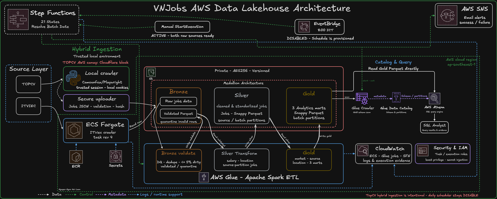

# 🚀 DataLens Data Lakehouse: Vietnam IT Job Market Analytics


## 📌 Project Overview

**DataLens** is a personal Data Engineering project that turns job listings from **ITviec** and **TopCV** into structured data for analyzing Vietnam's IT and data job market.

I first built the platform locally with Airflow, Spark, MinIO, Iceberg, Trino, PostgreSQL, and Metabase. I then implemented an AWS deployment using S3, AWS Glue, ECS Fargate, Step Functions, Glue Data Catalog, and Athena. Both implementations are retained in this repository.

The AWS version uses **hybrid ingestion**: ITviec is crawled on ECS Fargate, while TopCV job data is collected in a trusted local environment and uploaded through a validated utility. Once both inputs are ready, Step Functions runs the cloud processing workflow and publishes its result through SNS email notifications.

> **AWS deployment checkpoint:** batch processing, Gold catalog refresh, Athena queries, and SNS notifications have been verified. The daily EventBridge Scheduler configuration is provisioned but remains **DISABLED** because TopCV ingestion requires a manual input step.

**Start here:** [Local setup](docs/local/README.md) · [AWS operation](#aws-operation) · [TopCV hybrid runbook](docs/aws/TOPCV_HYBRID_INGESTION.md) · [AWS workflow definition](infra/aws/stepfunctions/vnjobs-data-pipeline-dev.asl.json)

---

## 🎯 Business Problem

Job platforms publish titles, locations, company names, and salaries in different formats. A useful comparison needs consistent records and a clear record of when each batch was collected.

DataLens prepares these records for questions such as:

- How many listings were collected for a given batch?
- How does job volume differ between sources and locations?
- What proportion of listings disclose a salary?
- What salary ranges are reported within each source, location, and currency?
- Did the processing workflow finish and publish queryable outputs?

The results describe the collected sample. They should not be interpreted as a complete census of Vietnam's job market.

---

## 🌍 Local and AWS Deployment Modes

| Component | Local implementation | AWS implementation |
| --- | --- | --- |
| Ingestion | Python crawlers with user-managed browser sessions | ITviec on ECS Fargate; validated manual TopCV uploads |
| Storage | MinIO | Separate S3 Bronze, Silver, and Gold buckets |
| Processing | Spark jobs | AWS Glue PySpark jobs |
| Orchestration | Apache Airflow | AWS Step Functions for processing and catalog refresh |
| Scheduling | Airflow DAG configuration | EventBridge Scheduler, provisioned and **DISABLED** |
| Analytical storage | Apache Iceberg tables | Partitioned Snappy Parquet files |
| Catalog | Hive Metastore | AWS Glue Data Catalog |
| SQL engine | Trino | Amazon Athena |
| BI serving | PostgreSQL and Metabase | SQL analysis through Athena |
| Notifications | Discord job alerts and reports | SNS email notifications for workflow success or failure |
| Runtime support | Docker Compose | ECR, Secrets Manager, IAM, and CloudWatch |

The local Iceberg tables, Metabase dashboards, and Discord alerts remain part of the local implementation. AWS marts use Parquet on S3 and have a separate SQL and notification path.

---

## 🏗️ Architecture

### AWS hybrid deployment



The diagram shows the processing, ingestion, metadata, and notification relationships. The ECS network configuration is described below.

| Relationship | Purpose |
| --- | --- |
| ITviec → ECS Fargate → S3 Bronze raw | Cloud ingestion |
| TopCV → local crawler → validated uploader → S3 Bronze raw | Hybrid ingestion |
| ECR → ECS | Crawler container image |
| Secrets Manager → ECS | Runtime cookie injection |
| Bronze Validate → validated Bronze | Record validation before transformation |
| Validated Bronze → Silver Transform → S3 Silver | Standardized job records |
| S3 Silver → Gold Aggregate → S3 Gold | Three analytical marts |
| Gold S3 → Glue Crawler → Glue Data Catalog | Schema and partition discovery |
| Glue Data Catalog → Athena; Gold S3 → Athena | Metadata lookup and direct Parquet reads |
| Step Functions → Glue jobs and Gold crawler | Processing orchestration |
| Step Functions → SNS → Email | Success and failure notifications |
| ECS, Glue jobs, and Step Functions → CloudWatch | Logs and execution evidence |

**Control boundary:** crawler tasks are launched separately. The current Step Functions definition begins with batch-date resolution and Bronze validation; it does not launch ECS ingestion.

**Network boundary:** the tested Fargate configuration uses `awsvpc`, an existing VPC, configured subnets and a security group, with public-IP assignment enabled. Internet access also depends on the deployed subnet routing. The diagram does not imply that all AWS services run inside the ECS subnet.

### Local deployment


See the [local guide](docs/local/README.md) for Airflow, MinIO, Spark, Iceberg, Trino, PostgreSQL, Metabase, and Discord setup.

---

## 🔁 AWS Pipeline Design

### 1. Ingestion Layer

| Source | Execution path | Operational requirement |
| --- | --- | --- |
| ITviec | Containerized crawler on ECS Fargate | Valid cookies injected through Secrets Manager |
| TopCV | Existing local crawler, followed by a reviewed JSON upload | Manual session maintenance and input preparation |

Crawler records include job title, URL, source, company, location, salary text, and other available fields. All stages must use the same explicit `batch_date`.

The TopCV uploader checks JSON structure, rejects sensitive credential-related keys, generates a canonical payload checksum, verifies the target AWS account and S3 versioning, and records safe ingestion metadata. It does not read cookie files or print job records.

### 2. Bronze Layer

Bronze keeps the original source JSON and the output of the deployed validation job in separate prefixes.

| Data | Path relative to the Bronze bucket |
| --- | --- |
| ITviec raw | `raw/source=itviec/batch_date=YYYY-MM-DD/itviec_jobs.json` |
| TopCV raw | `raw/source=topcv/batch_date=YYYY-MM-DD/topcv_jobs.json` |
| Validated records | `validated/jobs/source=<source>/batch_date=YYYY-MM-DD/` |

The deployed Bronze validator is the quality gate before Silver processing. Its validation and quarantine behavior is separate from the uploader's file checks.

### 3. Silver Layer

[The Glue Silver job](jobs/aws/glue_silver_job.py) reads validated Parquet for one batch and checks that both expected sources are present.

It trims required text fields, parses supported salary representations into minimum and maximum values, labels currency, maps locations to standard categories, and keeps one record per `(source, url)`. Optional missing fields are handled explicitly.

Output path relative to the Silver bucket:

```text
jobs/source=<source>/batch_date=YYYY-MM-DD/
```

Each source receives a deterministic batch prefix containing Parquet output. Salary parsing is heuristic, so unusual formats require additional parsing rules and tests.

### 4. Gold Layer

[The Glue Gold job](jobs/aws/glue_gold_job.py) reads one Silver batch, checks its required columns and sources, and publishes exactly three analytical marts.

Each mart is written to a deterministic date prefix. The job checks for empty outputs and verifies that the overview's distinct job count matches the Silver input count.

---

## 🧱 AWS Data Products

| Mart | Grain | Main metrics |
| --- | --- | --- |
| `job_market_overview` | Report date | Total jobs, companies, sources, locations, and jobs with salary |
| `source_performance` | Source and report date | Job count, company count, and jobs with salary |
| `location_summary` | Location, source, currency, and report date | Job count, salary availability, average minimum/maximum salary, and highest salary |

Gold prefixes are:

```text
marts/job_market_overview/batch_date=YYYY-MM-DD/
marts/source_performance/batch_date=YYYY-MM-DD/
marts/location_summary/batch_date=YYYY-MM-DD/
```

The location mart groups currencies separately. Its aggregates do not perform exchange-rate conversion.

---

## 🗄️ Athena Query Layer

The Gold crawler registers schemas and partitions in Glue Data Catalog. Athena uses that metadata to query the Gold Parquet files directly from S3.

Select the database and table names created by the deployed crawler. For example, after replacing both quoted identifiers with the actual catalog names:

```sql
SELECT report_date, total_jobs, total_companies, jobs_with_salary
FROM "YOUR_GLUE_DATABASE"."YOUR_OVERVIEW_TABLE"
WHERE batch_date = '2026-09-30';
```

Configure the Athena workgroup's query-result storage separately. Its output location is not the Gold mart source location. If the workgroup uses a customer-owned S3 result location, include that bucket or prefix in the deployment configuration.

---

## 📣 SNS Email Notifications and CloudWatch

Step Functions publishes workflow outcomes to the SNS topic `vnjobs-data-pipeline-alerts-dev`. A confirmed email subscription receives execution identifiers and the batch date; failure notifications also include an error identifier.

The workflow reports processing success after the Gold crawler completes successfully. Notifications describe pipeline execution status rather than local Discord high-salary alerts.

CloudWatch supports investigation of crawler runtime, Glue processing, and workflow execution. The crawler log group is `/ecs/vnjobs-crawler-dev`.

---

## ✅ Data Quality and Security

- The manual uploader accepts a non-empty JSON array of objects and rejects credential-related keys.
- Silver requires non-empty validated input, mandatory columns, and both expected sources.
- Silver removes blank titles/URLs and deduplicates by source and URL.
- Gold requires non-empty inputs and marts, and reconciles its total with Silver input.
- Bronze, Silver, and Gold buckets have public-access blocking, AES256 encryption, and versioning enabled in the tested deployment.
- ECS receives session cookies through Secrets Manager; its execution role has scoped secret-read permission, while its task role supplies application access to S3.
- The crawler image is built for Linux AMD64 and runs as a non-root user. Cookie JSON files are excluded from the image.

AWS keys, `.env` files, browser cookies, and account passwords are kept outside version control. Browser session renewal remains a manual operational task.

---

## 🧪 Testing and Verified Outputs

Run the repository tests in a Python environment with the project dependencies and pytest installed:

```bash
python -m pytest tests -q -p no:cacheprovider
```

The AWS branch includes tests for crawler storage selection, cookie loading, TopCV page classification, manual upload behavior, Silver/Gold job contracts, and the Scheduler/IAM configuration. Normalization tests also remain in the repository.

Unit and contract tests complement the runtime checks performed on AWS:

| Checkpoint | Verified evidence |
| --- | --- |
| ITviec ECS canary | Cookies loaded from environment, container exit code `0`, fresh versioned raw S3 output |
| TopCV ECS canary | Cookies injected and Camoufox started; Cloudflare blocked access and no raw output was published |
| Hybrid TopCV upload | A 50-record batch for `2026-09-30`, versioned object metadata, and matching readback checksum |
| Silver reference batch | `2026-09-27`: 48 ITviec records + 50 TopCV records; 98 input and 98 output records |
| Gold and query path | Three mart prefixes, Glue catalog refresh, and successful Athena queries |
| Notification paths | Successful processing notifications and controlled failure notifications |
| Scheduler canary | Real invocation, context-token substitution, expected missing-data failure, and SNS notification |

These are development checkpoint results. Local dashboard sample counts and cloud batch counts refer to different runs.

---

## 🔁 Backfill, Reruns, and Scheduling

Manual workflow input accepts a specific processing date:

```json
{
  "batch_date": "2026-09-30"
}
```

Use the date corresponding to the prepared source files, including for backfills. Silver and Gold replace only the relevant source/mart batch prefixes before writing their output, which avoids accumulating duplicate current files on a successful rerun.

This prefix replacement is not an atomic transaction across the complete batch. Run only one writer for a batch at a time and inspect outputs after interrupted runs. S3 versioning supports object-level recovery.

The state machine catches processing failures and routes them to SNS. Its current Glue states do not define automatic `Retry` blocks. The Scheduler target's invocation retry policy is separate from processing retries.

The versioned daily schedule uses:

| Setting | Value |
| --- | --- |
| Expression | `cron(0 8 * * ? *)` |
| Time zone | `Asia/Ho_Chi_Minh` |
| Flexible time window | `OFF` |
| State | **`DISABLED`** |

The Scheduler contract has been tested, but the daily schedule is kept disabled while TopCV requires manual raw input. Literal Scheduler context tokens are preserved in the versioned target input.

---

## 🛠️ AWS Tech Stack

| Category | Technology |
| --- | --- |
| Language and processing | Python, SQL, PySpark, AWS Glue |
| Browser ingestion | Camoufox, Playwright |
| Containers | Docker, Amazon ECR, Amazon ECS on AWS Fargate |
| Networking | Amazon VPC, configured subnets, task security group |
| Storage | Amazon S3, JSON, partitioned Snappy Parquet |
| Orchestration | AWS Step Functions |
| Scheduling | Amazon EventBridge Scheduler — provisioned, disabled |
| Metadata | AWS Glue Crawler and Glue Data Catalog |
| SQL analytics | Amazon Athena |
| Session secrets and permissions | AWS Secrets Manager, AWS IAM |
| Logs | Amazon CloudWatch |
| Workflow notifications | Amazon SNS with email subscription |
| Testing | pytest |

---

## 📂 Project Structure

| Path | Responsibility |
| --- | --- |
| `dags/` | Local Airflow orchestration |
| `jobs/crawlers/` | Crawlers, storage backend, cookies, and page classification |
| `jobs/spark/` | Local processing jobs |
| `jobs/aws/glue_silver_job.py` | Cloud Silver transformation |
| `jobs/aws/glue_gold_job.py` | Cloud Gold aggregation |
| `jobs/notifications/` | Local Discord implementation |
| `jobs/trino/` | Local query-engine configuration |
| `infra/aws/stepfunctions/` | Versioned state machine definition |
| `infra/aws/scheduler/` | Disabled daily schedule manifest |
| `infra/aws/iam/` | Versioned Scheduler role contracts |
| `scripts/aws/upload_topcv_raw.py` | Validated manual TopCV uploader |
| `docs/local/README.md` | Local deployment guide |
| `docs/aws/TOPCV_HYBRID_INGESTION.md` | Cloud TopCV operation runbook |
| `tests/` | Normalization and AWS contract tests |
| `images/` | Architecture and local dashboard screenshots |
| `Dockerfile.crawler` | ECS crawler image |
| `docker-compose.yml` | Local service deployment |

The deployed Bronze Glue script is currently hosted in the deployment's Glue-assets S3 location. The AWS branch versions the Silver and Gold scripts; exporting and versioning the deployed Bronze script remains a reproducibility improvement.

---

## 🚀 How to Run Locally

The local deployment is retained. Follow the [local setup guide](docs/local/README.md) for environment variables, Docker Compose services, the `spark_ssh` Airflow connection, crawler sessions, and dashboard verification.

Local processing uses Airflow and MinIO. AWS processing uses the S3 batch contract and Step Functions. Choose the intended storage backend before running a crawler.

---

<a id="aws-operation"></a>

## ☁️ How to Run on AWS

The tested deployment is in **`ap-southeast-1`**. This is a setup and operation guide for the documented development environment, not a one-command infrastructure installer.

### 1. Prepare the environment

Create or reuse private, encrypted, versioned Bronze/Silver/Gold S3 buckets; an ECR repository; an ECS Fargate task definition; service roles; and a CloudWatch log group. Configure the task's VPC, subnets, security group, and internet routing.

Use Secrets Manager references for cookie injection. Configure the execution role for image retrieval, logging, and secret access, and the task role for application S3 access.

Resource names, account-specific ARNs, bucket names, and the uploader's account guard must be adapted before deploying to another AWS account.

### 2. Configure the processing workflow

| Resource | Reference name |
| --- | --- |
| Bronze Glue job | `vnjobs-bronze-validate-dev` |
| Silver Glue job | `vnjobs-silver-transform-dev` |
| Gold Glue job | `vnjobs-gold-aggregate-dev` |
| Gold crawler | `vnjob-gold-crawler-dev` |
| State machine | `vnjobs-data-pipeline-dev` |
| Daily schedule | `vnjobs-data-pipeline-daily-dev` |

Upload the Glue scripts to the selected S3 script locations and configure their arguments to match the workflow. Configure the crawler to scan the Gold marts, an Athena workgroup, and a confirmed SNS email subscription. Deploy the [state machine definition](infra/aws/stepfunctions/vnjobs-data-pipeline-dev.asl.json).

### 3. Prepare both raw sources

Run an ITviec ECS task with `/app/jobs/crawlers/crawler_itviec.py` as its command and set `BATCH_DATE` explicitly. The S3 ingestion configuration uses `STORAGE_BACKEND=s3`, `S3_BUCKET`, `S3_RAW_PREFIX`, and `AWS_REGION`.

Generate TopCV job JSON using the existing local workflow. Validate the exported file first:

```powershell
python scripts/aws/upload_topcv_raw.py `
  --input "C:\path\to\topcv_jobs.json" `
  --batch-date "2026-09-30" `
  --dry-run
```

Replace the example file path and date with the actual input. After a successful dry-run, follow the [hybrid runbook](docs/aws/TOPCV_HYBRID_INGESTION.md) to perform the controlled upload. That runbook documents identical-payload handling and reviewed corrections.

Before starting processing, confirm that both raw JSON objects exist for the same batch date. A file in an older date prefix does not satisfy this input contract.

### 4. Execute and verify

In the Step Functions console, start an execution with the explicit `batch_date` JSON shown above. Check the Glue runs, catalog refresh, terminal execution status, and SNS email.

Confirm validated Bronze and Silver Parquet for both sources, all three Gold mart prefixes, and the expected batch partition in Athena. Keep the daily Scheduler **DISABLED** while the manual TopCV input step exists.

---

## 📸 Screenshots and Documentation

- [AWS architecture](images/aws/VNJobs_AWS_Architecture.png)
- [Local architecture](images/DataLens_Data_LakeHouse_Architecture.png)
- [Local Airflow DAG](images/dags_of_jobs.png)
- [Local Metabase dashboard](images/Dashboard_1.png)
- [Local jobs dashboard](images/dashboard_2.png)
- [TopCV hybrid ingestion runbook](docs/aws/TOPCV_HYBRID_INGESTION.md)
- [Job listing data contract](docs/data_contract_job_listing.md)
- [Local salary parsing](docs/salary_parsing.md)
- [Local data quality rules](docs/data_quality_rules.md)
- [Local backfill and retry strategy](docs/backfill_retry_strategy.md)

The local documentation describes local behavior. AWS job behavior is defined by the cloud scripts and workflow linked above.

---

## 🧠 What This Project Demonstrates

| Skill | Evidence |
| --- | --- |
| Cloud migration | Local batch-processing concepts implemented with AWS managed services |
| Batch ETL | Date-scoped Bronze validation, Silver transformation, and Gold aggregation |
| Data modeling | Three cloud marts with explicit grains and partition paths |
| Runtime security | Non-root crawler image and Secrets Manager cookie delivery |
| Orchestration | Glue execution, bounded crawler polling, and notification branches |
| SQL analytics | Glue catalog metadata and Athena queries over S3 Parquet |
| Testing | Logic tests, AWS contract tests, and controlled runtime canaries |
| Operational decisions | Explicit hybrid ingestion boundary and disabled daily schedule |

This project supports my preparation for **Data Engineer Intern / Fresher** opportunities.

---

## 🔮 Future Improvements

- Version the deployed Bronze script, ECS task definition, and remaining deployment configuration.
- Add infrastructure provisioning and CI checks for repeatable deployments.
- Add source freshness checks before workflow execution and strengthen batch concurrency controls.
- Improve salary parsing for unusual formats and multi-location listings.
- Add retention policies for logs and noncurrent S3 object versions.
- Evaluate an approved source integration for unattended TopCV ingestion before enabling daily scheduling.
- Extend cloud analytics and add a BI interface when there is a concrete reporting need.

---

## ⚠️ Scope and Disclaimer

DataLens is an educational portfolio project tested with development batches. The AWS implementation uses Parquet-based analytics; transactional Iceberg behavior belongs to the local implementation.

TopCV AWS access was blocked even after successful cookie injection and browser startup. That evidence does not establish one exact Cloudflare blocking rule. The chosen operation path is local collection followed by a validated upload; account login and cookie renewal are manual.

Collect data only within the source's access permissions, terms, and rate limits. Store job payloads separately from authentication material.

---

## 🤝 Let's Connect

Building DataLens helped me move from analyzing datasets toward designing the systems that prepare them. The local implementation taught me processing, catalog, and BI integration; the AWS deployment added practical experience with IAM, containers, managed ETL, and workflow operations.

- 💼 [Nguyen Ngoc Hai Luan — LinkedIn](https://www.linkedin.com/in/nguyen-ngoc-hai-luan-67098531a/)
- 📧 [nguyenngochailuan16112003@gmail.com](mailto:nguyenngochailuan16112003@gmail.com)
- 💻 [Original local project](https://github.com/LuanHai23/DataLens_DataLakeHouse/tree/main)

---

## 🌟 Explore More

**Binance API Data Lakehouse** — my other Data Engineering project, covering real-time market-data ingestion and stream processing.
