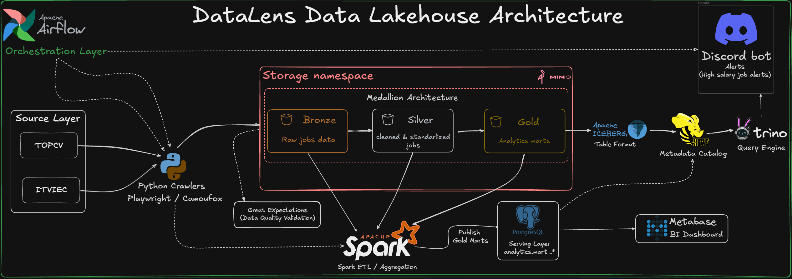
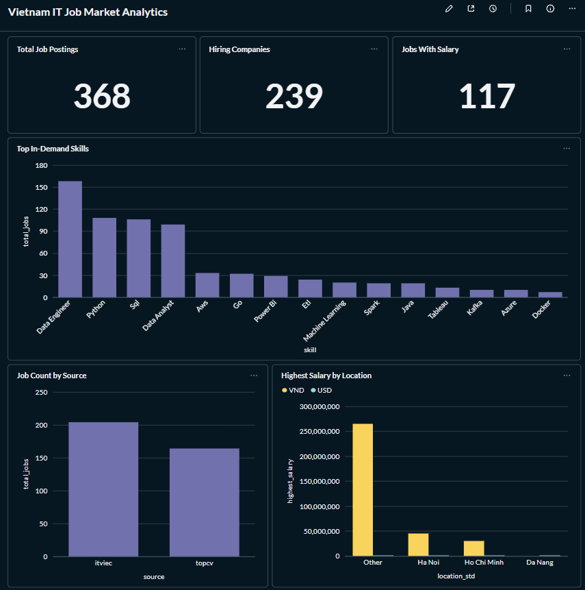
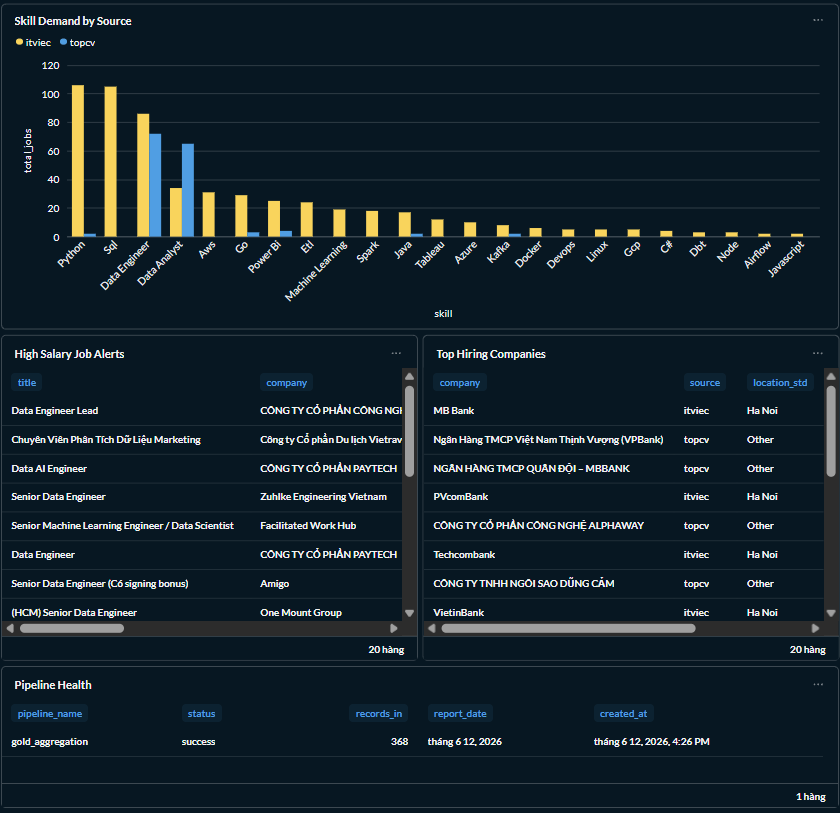

# 🏠 DataLens — Local Deployment

[Back to project overview](../../README.md)

This guide keeps the local implementation available alongside the AWS deployment. It follows the original project README and the repository's Docker Compose and Airflow configuration.

The local stack uses **Airflow, Spark, MinIO, Iceberg, Hive Metastore, Trino, PostgreSQL, Metabase, and Discord**. AWS jobs and their Parquet marts have a separate execution path.

## 🏗️ Local Architecture



| Stage | Local responsibility |
| --- | --- |
| Python crawlers | Collect ITviec and TopCV listings using a valid browser session |
| MinIO | Preserve raw source data and processing outputs |
| Bronze validation | Apply the local validation rules before transformation |
| Spark Silver | Normalize and prepare job records |
| Spark Gold and Iceberg | Publish analytical tables |
| Hive Metastore and Trino | Register and query lakehouse tables |
| PostgreSQL and Metabase | Serve and visualize the local analytical marts |
| Discord | Send configured local reports and job alerts |

## 🚀 Prerequisites and Configuration

Use Docker with Docker Compose and sufficient memory for the complete service stack; the original setup recommends at least 8 GB allocated to Docker.

Create a private `.env` in the repository root. Match its database/storage values to the client configuration used by the local jobs.

| Variables | Purpose |
| --- | --- |
| `POSTGRES_USER`, `POSTGRES_PASSWORD` | Local PostgreSQL credentials |
| `MINIO_ROOT_USER`, `MINIO_ROOT_PASSWORD` | Local object-store credentials |
| `MB_DB_USER`, `MB_DB_PASS`, `MB_DB_HOST` | Metabase application database connection |
| `SERVING_POSTGRES_HOST`, `SERVING_POSTGRES_PORT`, `SERVING_POSTGRES_DB`, `SERVING_POSTGRES_USER`, `SERVING_POSTGRES_PASSWORD` | Local Gold serving connection where used by the checked-out Compose configuration |
| `DISCORD_WEBHOOK_URL`, `DISCORD_TOKEN` | Local notification integrations |

The development Compose files include some fixed connection settings. Changing a credential requires updating the dependent clients consistently, including the Airflow database connection; setting only one environment variable may be insufficient.

Prepare valid crawler cookies using the existing manual workflow. The AWS branch's local Compose configuration mounts the Playwright cookie JSON files under `jobs/crawlers/json_cookies/`. Keep these files and `.env` outside Git.

Check the selected checkout's bind mounts, including any PostgreSQL JDBC JAR required by the Spark image. Browser sessions and runtime assets are not replaced by the cloud deployment.

## ▶️ Start Services

From the repository root:

```bash
docker compose up -d
docker compose ps
```

| Service | Local URL |
| --- | --- |
| Airflow | http://localhost:8081 |
| MinIO Console | http://localhost:9001 |
| Spark Master | http://localhost:8080 |
| Trino | http://localhost:8082 |
| Metabase | http://localhost:3000 |

On an existing installation, retain the established volumes and connection settings. For a clean installation, ensure the `airflow-init` service completes the database/user setup before triggering the DAG.

## 🔁 Configure and Trigger Airflow

The DAG is **`job_hunter_pipeline`**. Its crawler and Spark tasks use the Airflow SSH connection **`spark_ssh`**.

Create that SSH connection for the Spark execution host. Inside the Compose network, use the `spark-master` service hostname and port `22`, with the SSH credentials configured in the Spark image. The host-mapped port `2222` is for access from outside that network.

Before triggering the DAG, confirm that the execution host can access `/jobs`, its browser dependencies, MinIO, and the local catalog/serving dependencies. Use `STORAGE_BACKEND=minio` for the local crawler path; AWS ingestion uses `s3`.

Enable and manually trigger `job_hunter_pipeline` in Airflow. Its main processing tasks include:

- `bronze_crawl_topcv` and `bronze_crawl_itviec`
- `validate_bronze_ge`
- `silver_transform`
- `gold_aggregate`
- `check_alerts`, followed by `notify_discord` or `skip_notify`

Inspect task logs as well as their status. A skipped notification branch can be expected when no alert condition is met.

## 🗄️ Check Analytical and Serving Tables

Open Trino:

```bash
docker exec -it trino-coordinator trino
```

```sql
SHOW TABLES FROM demo.gold;

SELECT *
FROM demo.gold.mart_job_market_overview
LIMIT 10;
```

The original local design documents these analytical marts:

| Local mart | Purpose |
| --- | --- |
| `mart_job_market_overview` | Market overview |
| `mart_source_performance` | Source contribution |
| `mart_salary_by_location` | Location and salary analysis |
| `mart_company_hiring_trend` | Company hiring activity |
| `mart_skill_demand` | Skills analysis |
| `mart_high_salary_alerts` | Job alert selection |
| `mart_pipeline_health` | Processing health |

Legacy tables are also used by some local notification code. Confirm which tables the checked-out jobs actually publish before configuring dashboards.

Check PostgreSQL using the configured local username:

```bash
docker exec -it postgres_jobs psql -U admin -d warehouse_db -c "\dt analytics.*"
```

The example uses the original development user `admin`; substitute the deployed local user if it differs.

Connect Metabase to the PostgreSQL serving database at `postgres:5432`, database `warehouse_db`, schema `analytics`, using your local credentials. These are the analytical data-source settings; Metabase's own application database configuration is separate.

## 📊 Local Dashboards and Notifications






Discord belongs to the local implementation. Its configured alerts use local Gold data; the cloud workflow sends execution notifications through SNS email.

The original README's 368-job dashboard sample is a historical local result. It is not an AWS output count and is not a promise about a new crawl.

## ✅ Testing and Documentation

```bash
python -m pytest tests -q -p no:cacheprovider
```

Run tests against the selected checkout with its dependencies installed. The AWS branch adds contract tests, so its test inventory differs from the original local normalization suite.

- [Job listing contract](../data_contract_job_listing.md)
- [Salary parsing](../salary_parsing.md)
- [Local data quality rules](../data_quality_rules.md)
- [Local backfill and retries](../backfill_retry_strategy.md)
- [Original local README](https://github.com/LuanHai23/DataLens_DataLakeHouse/blob/main/README.md)

This documentation keeps the local stack distinct from the AWS Glue, Step Functions, and Athena implementation. Adding AWS deployment documentation does not require deleting the local code, dashboards, or service configuration.
